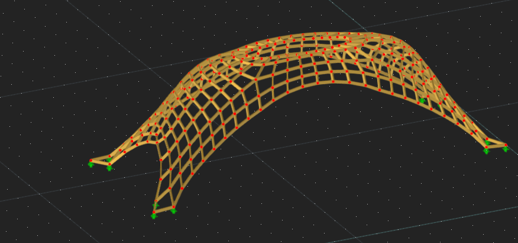

# Timber Grid Shell: Parametric Design and Structural Analysis

This project presents the design and analysis of a timber grid shell structure, integrating tools such as **Grasshopper** and **RFEM**. Developed as part of a structural design study, the goal was to create an efficient, sustainable and aesthetically pleasing structure while optimising its structural performance through iterative design and analysis.

## Project Overview
- **Primary Focus**: Designing a shell structure.
- **Tools Used**:
  - **Grasshopper**: For parametric modeling, form-finding and geometry optimization.
  - **RFEM**: For structural analysis, including load evaluation and safety verification.

## Grasshopper Parametric Design
Grasshopper played a central role in this project, enabling rapid changes and optimization during the design process. Key steps included:
1. **Form-Finding**: Using Grasshopper plugins like Kangaroo2 to determine equilibrium shapes under compressive forces.
2. **Mesh Optimization**: Generating a quad-based mesh with controlled edge lengths for structural consistency.
3. **Interactive Physics Simulations**: Simulating loads and adjusting parameters to refine the shell's geometry.

## RFEM Structural Analysis
Structural analysis was performed in RFEM to validate the design. Key analyses included:
- **Load Evaluation**: Considering permanent loads, wind loads and snow loads.
- **Safety Checks**: Verifying bending, compression and buckling through Unity Checks.
- **Serviceability**: Assessing deformations to ensure compliance with allowable displacement limits.

### Iterative Design Improvements
Initial analysis highlighted areas where the structure did not meet safety or serviceability criteria. Two solutions were proposed:
1. **Option 1**: Increase cross-sectional dimensions to enhance performance but at a higher material cost.
2. **Option 2 (Chosen)**: Add diagonal members at the edges and resize the inner members, reducing material usage while ensuring compliance.

## Files in This Repository
- **Timber_GridShell.gh**: Grasshopper file containing the parametric model of the grid shell.
- **Paper_ChristiaanBakker.pdf**: Detailed report on the design and analysis process, including results and discussion.
